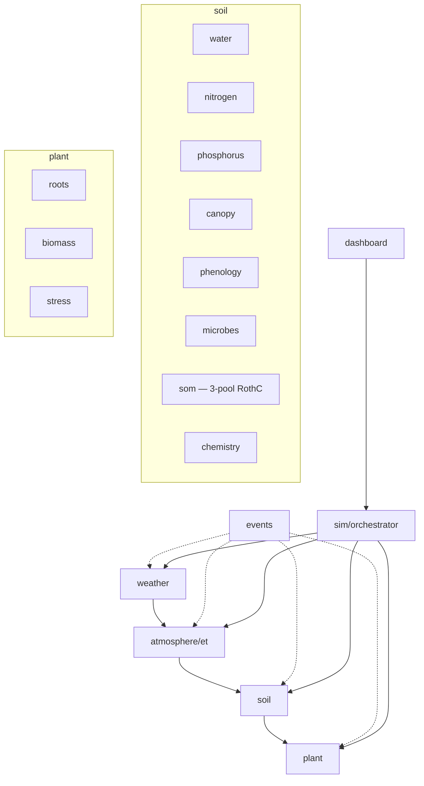

# Architecture Overview

AgroGame is a soil-plant-atmosphere simulation engine that advances on a daily timestep. The orchestrator coordinates domain modules via an event bus, enforcing clean dependency boundaries.

## Module Dependency Diagram



**Arrows** show allowed import directions. Dashed lines indicate event subscriptions (runtime coupling only). The `sim` orchestrator sits above all domain modules and must not be imported by them.

## Dependency Rules (import-linter)

| Contract | Rule |
|----------|------|
| **events_isolated** | `agrogame.events` must not import any domain module |
| **weather_independence** | `weather` must not import soil, plant, atmosphere, or sim |
| **atmosphere_independence** | `atmosphere` must not import soil |
| **soil_plant_direction** | `soil` must not import `plant` |
| **plant_independence** | `plant` must not import `atmosphere` |
| **sim_isolation** | Domain modules must not import `agrogame.sim` |
| **soil_subdomain_independence** | water, nitrogen, canopy, phenology are independent |
| **plant_vs_soil** | `plant` must not import soil subdomains directly |
| **domain_layers** | weather → atmosphere → soil → plant (layered) |

Run `poetry run lint-imports` to verify all contracts.

## Event Contracts

Cross-module communication is event-driven via `agrogame.events.EventBus`. All events inherit from `BaseEvent` and are debug-logged at emit.

### Key Event Flows

| Event | Emitter | Subscriber(s) | Phase |
|-------|---------|----------------|-------|
| `DayTick` | `Calendar` | All runtimes | Orchestrator |
| `WeatherLoaded` | `WeatherModule` | ET, dashboard | weather |
| `EvaporationTaken` | ET runtime | Dashboard, water | atmosphere |
| `TranspirationByLayer` | ET runtime | Water, N mass-flow | atmosphere |
| `WaterStressComputed` | ET runtime | Canopy, dashboard | atmosphere |
| `NutrientStressComputed` | N/P runtimes | Canopy, dashboard | nutrients |
| `RootDistributionUpdated` | Root module | SOM, microbes | plant |
| `SubstrateAvailable` | SOM runtime | Microbes | nutrients |
| `MicrobialActivityComputed` | Microbes runtime | Dashboard | nutrients |
| `EnzymeGroupTotals` | Microbes runtime | Dashboard | nutrients |

### Event Handler Rules

- Handlers must be fast; no blocking I/O
- Avoid cross-module state mutation in handlers
- Prefer module-local events; keep contracts stable
- Minimal payloads with validated types

## Module Status

| Module | Status | Notes |
|--------|--------|-------|
| `weather` | Stable | NASA POWER ingestion, sanitization |
| `atmosphere/et` | Stable | PT and PM methods, VPD partitioning |
| `soil/water` | Stable | Cascading bucket, SCS runoff |
| `soil/nitrogen` | Stable | Mineralization, nitrification, leaching |
| `soil/phosphorus` | Stable | Slow-release, pH effects |
| `soil/phenology` | Stable | Thermal time, GDD stages |
| `soil/canopy` | Stable | LAI, light interception, RUE |
| `soil/microbes` | Stable | Monod growth, enzymes, F:B ratio |
| `soil/som` | Stable | Three-pool RothC-inspired decomposition (AGRO-103) |
| `soil/chemistry` | Stable | pH buffering |
| `plant/roots` | Stable | Continuous/discrete allocation |
| `plant/biomass` | Stable | Partitioning, sink limitation |
| `plant/stress` | Stable | Liebig/multiplicative, water/N/P |
| `sim` | Stable | Builder, orchestrator, calendar |
| `dashboard` | Stable | Streamlit app, split into simulation/charts/export |
| `config` | Stable | JSON schemas, hot-reload |

## Data Flow (Daily Step)

```
1. Calendar emits DayTick(phase="weather")
   → WeatherModule loads/extends record

2. DayTick(phase="atmosphere")
   → ET computes reference ET, actual ET
   → Emits EvaporationTaken, TranspirationByLayer, WaterStressComputed

3. DayTick(phase="water")
   → Water model: rainfall infiltration, drainage, storage update

4. DayTick(phase="nutrients")
   → SOM emits SubstrateAvailable per layer
   → Microbes: Monod growth, enzyme production
   → Nitrogen: mineralization, nitrification, uptake, leaching
   → Phosphorus: mineralization, sorption, uptake

5. DayTick(phase="plant")
   → Phenology: GDD accumulation, stage transitions
   → Canopy: LAI update, biomass via RUE
   → Roots: depth extension, fraction allocation
   → Stress: Liebig minimum of water/N/P factors
```

See [Data Flow](data-flow.md) and [Event-driven Scheduling](event-driven-scheduling.md) for details.
